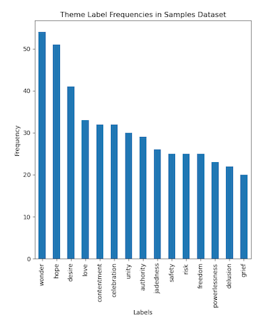

# Data Summary

**Total number of samples**: 3343

**Recognizable samples**: 130 (3.9%)

**Processed samples**: 2406 (72.0%)

-> **Unprocessed samples**: 937

**Recognized / Processed samples**: (5.4%)

## Label Statistics

| label        | 0 | 1 |  %   |
| ------------ | --- | --- | ---- |
| love         |  96 |  34 | 26.2 |
| contentment  |  98 |  32 | 24.6 |
| desire       |  90 |  40 | 30.8 |
| celebration  |  99 |  31 | 23.8 |
| grief        | 111 |  19 | 14.6 |
| unity        | 100 |  30 | 23.1 |
| safety       | 106 |  24 | 18.5 |
| risk         | 107 |  23 | 17.7 |
| wonder       |  76 |  54 | 41.5 |
| hope         |  80 |  50 | 38.5 |
| jadedness    | 105 |  25 | 19.2 |
| delusion     | 107 |  22 | 17.1 |
| authority    | 102 |  28 | 21.5 |
| powerlessness| 107 |  23 | 17.7 |
| freedom      | 106 |  24 | 18.5 |

## Sorted Label Statistics

| label |0  | 1  |    % |
| --- | -- | -- | -- |
|wonder        |  76 |  54 | 41.5 |
|hope          |  80 |  50 | 38.5 |
|desire        |  90 |  40 | 30.8 |
|love          |  96 |  34 | 26.2 |
|contentment   |  98 |  32 | 24.6 |
|celebration   |  99 |  31 | 23.8 |
|unity         | 100 |  30 | 23.1 |
|authority     | 102 |  28 | 21.5 |
|jadedness     | 105 |  25 | 19.2 |
|safety        | 106 |  24 | 18.5 |
|freedom       | 106 |  24 | 18.5 |
|risk          | 107 |  23 | 17.7 |
|powerlessness | 107 |  23 | 17.7 |
|delusion      | 107 |  22 | 17.1 |
|grief         | 111 |  19 | 14.6 |

## Theme Label Frequenceies

